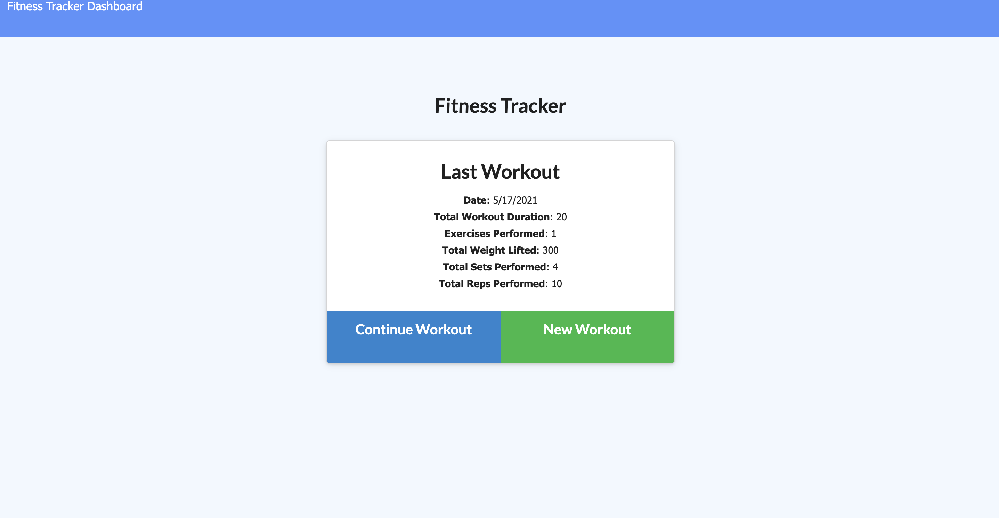
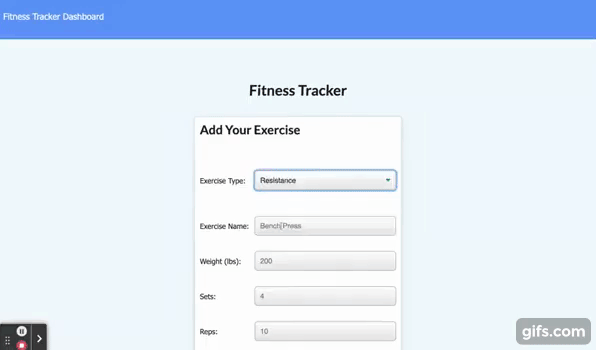

# Workout-Tracker

[**Deployed Link**](https://fittracker210518.herokuapp.com/)

[**GitHub Link**](https://github.com/GregPetropoulos/Workout-Tracker)




## Description
Create a workout tracker and (NoSQL) Mongo database with a Mongoose schema and handle routes with Express. Use the MVC paradigm and connect the back end to the front end.



[Video link](https://youtu.be/XUCwTeqXqIo)

## Badges
[](https://forthebadge.com)
[](https://forthebadge.com)[](https://forthebadge.com)[](https://forthebadge.com)[](https://forthebadge.com)

## User Story
* As a user, I want to be able to view create and track daily workouts. I want to be able to log multiple exercises in a workout on a given day. I should also be able to track the name, type, weight, sets, reps, and duration of exercise. If the exercise is a cardio exercise, I should be able to track my distance traveled.

## Business Context

* A consumer will reach their fitness goals more quickly when they track their workout progress.


## Table of Contents

- [Installation](#installation)
- [Schema Models](#schema-models)
- [Database Models](#database-models)
- [Associations](#associations)
- [Seeding](#seeding)
- [Credits](#credits)
- [Badges](#badges)
- [Features](#features)
- [How to Contribute](#how-to-contribute)
- [Tests](#tests)
- [Code of Conduct](#contributor-covenant-code-of-conduct)
- [License](#license)

## Installation

The appropriate packages consists of

- npm i
- npm init
- npm install dotenv
- npm install express
- npm install mongoose
- npm install mongoose-morgan
- npm install morgan
- npm install nodemon
- npm install seed

## Schema Models

The Workout.js contains models contain the following:
```
const mongoose = require("mongoose");
const Schema = mongoose.Schema;

const WorkoutSchema = new Schema({
  day: {
    type: Date,
    default: Date.now,
  },
  exercises: [
    {
      type: {
        type: String,
        trim: true,
        enum: ["resistance", "cardio"],
        required: [true, "Workout type is Required"],
      },
      name: {
        type: String,
        trim: true,
        required: "Name of Exercise Required",
      },

      distance: {
        type: Number,
      },
      duration: {
        type: Number,
        required: [true, "Duration in Minutes Required"],
      },
      weight: {
        type: Number,
      }, 
      sets: {
        type: Number,
      },
      reps: {
        type: Number,
      },
    },
  ],
  // New totalDuration dynamically shows up here 
  // with the sum of last 7 days see apiRoutes line 67
});

const Workout = mongoose.model("Workout", WorkoutSchema);

module.exports = Workout;

```
## Seeding

### After running the

```
 npm run seed

```

From the command line the workout database was seeded and verified on *Robo3T*


## All CRUD operations successful with use of **GET, POST, PUT, DELETE**.


## Credits

* [NoSQL](https://en.wikipedia.org/wiki/NoSQL)
* [MongoDB Website](https://www.mongodb.com/)
* [Robo 3T Website](https://robomongo.org/download)
* [MongoJS Documentation](https://www.npmjs.com/package/mongojs)
* [Mongoose Documentation](http://mongoosejs.com/docs/guide.html)
* [MongoDB Cheat Sheet](https://developer.mongodb.com/quickstart/cheat-sheet/)
* [Mongo Query](https://docs.mongodb.com/manual/reference/operator/query/)
* [Mongo Update Operators](https://docs.mongodb.com/manual/reference/operator/update/)
* [Mongo Operators](https://docs.mongodb.com/manual/reference/operator/)
* [npm mongo](https://www.npmjs.com/package/mongojs)
* [Mongo Atlas](thttps://www.mongodb.com/cloud/atlas1)
* [Mongoose Aggregate Docs](https://mongoosejs.com/docs/api.html#aggregate_Aggregate)
* [MongoDB $addFileds Operator](https://docs.mongodb.com/manual/reference/operator/aggregation/addFields/)
* [MongoDB $sum Operator](https://docs.mongodb.com/manual/reference/operator/aggregation/sum/)

## mongoDB Aggregation Pipeline Stages
|Stage|Description|
-------|--------
|$addFields|Adds new fields to documents. Similar to $project, $addFields reshapes each document in the stream; specifically, by adding new fields to output documents that contain both the existing fields from the input documents and the newly added fields. $set is an alias for $addFields.|
|$sum|Calculates and returns the sum of numeric values. $sum ignores non-numeric values.
|$limit|Passes the first n documents unmodified to the pipeline where n is the specified limit. For each input document, outputs either one document (for the first n documents) or zero documents (after the first n documents).|
|$sort|Reorders the document stream by a specified sort key. Only the order changes; the documents remain unmodified. For each input document, outputs one document.|
------
[**Link for Aggregations**](https://docs.mongodb.com/manual/reference/operator/aggregation-pipeline/)

**See code in apiRoutes.js get request for use case**
```

router.get("/api/workouts/range", async (req, res) => {
  try {
    const workoutData = await Workout.aggregate([
      {
        $addFields: {
          totalDuration: {
            $sum: '$exercises.duration'
          }
        }
      }
    ])
    .sort({_id: -1})
    .limit(7)
    res.json(workoutData);
  } catch (err) {
    console.log(err);
    res.sendStatus(500).json(err);
  }
});
```
I have added an additional field called TotalDuration dynamically into the Workout.js model. Inside the new new field is an object with the $sum as the key adding sum of numeric values in the exercises array at the duration.

**See code in the Workout.js below, specifically duration**
``` exercises: [
    {
      type: {
        type: String,
        trim: true,
        enum: ["resistance", "cardio"],
        required: [true, "Workout type is Required"],
      },
      name: {
        type: String,
        trim: true,
        required: "Name of Exercise Required",
      },

      distance: {
        type: Number,
      },
      duration: {
        type: Number,
        required: [true, "Duration in Minutes Required"],
      },

```

I had to use $sort to only see the last 7 days and not the first 7 days entered.
```
.sort({_id: -1})
```
Lastly, the $limit gave me the number of days to bring into the model.
```
.limit(7)
```

## Acceptance Criteria
When the user loads the page, they should be given the option to create a new workout or continue with their last workout.

The user should be able to: 
* ## Features
  * Add exercises to the most recent workout plan.

  * Add new exercises to a new workout plan.

  * View the combined weight of multiple exercises from the past seven workouts on the `stats` page.

  * View the total duration of each workout from the past seven workouts on the `stats` page.


## How to Contribute

- Fork the repo make changes on your local machine.
- Add a comment describing contribution for approval and review
## Tests

No testing on this app

## Contributor Covenant Code of Conduct

### Our Pledge

We as members, contributors, and leaders pledge to make participation in our
community a harassment-free experience for everyone, regardless of age, body
size, visible or invisible disability, ethnicity, sex characteristics, gender
identity and expression, level of experience, education, socio-economic status,
nationality, personal appearance, race, caste, color, religion, or sexual identity
and orientation.

We pledge to act and interact in ways that contribute to an open, welcoming,
diverse, inclusive, and healthy community.

## Our Standards

Examples of behavior that contributes to a positive environment for our
community include:

- Demonstrating empathy and kindness toward other people
- Being respectful of differing opinions, viewpoints, and experiences
- Giving and gracefully accepting constructive feedback
- Accepting responsibility and apologizing to those affected by our mistakes,
  and learning from the experience
- Focusing on what is best not just for us as individuals, but for the
  overall community

Examples of unacceptable behavior include:

- The use of sexualized language or imagery, and sexual attention or
  advances of any kind
- Trolling, insulting or derogatory comments, and personal or political attacks
- Public or private harassment
- Publishing others' private information, such as a physical or email
  address, without their explicit permission
- Other conduct which could reasonably be considered inappropriate in a
  professional setting

## Enforcement Responsibilities

Community leaders are responsible for clarifying and enforcing our standards of
acceptable behavior and will take appropriate and fair corrective action in
response to any behavior that they deem inappropriate, threatening, offensive,
or harmful.

Community leaders have the right and responsibility to remove, edit, or reject
comments, commits, code, wiki edits, issues, and other contributions that are
not aligned to this Code of Conduct, and will communicate reasons for moderation
decisions when appropriate.

## Scope

This Code of Conduct applies within all community spaces, and also applies when
an individual is officially representing the community in public spaces.
Examples of representing our community include using an official e-mail address,
posting via an official social media account, or acting as an appointed
representative at an online or offline event.

## Enforcement

Instances of abusive, harassing, or otherwise unacceptable behavior may be
reported to the community leaders responsible for enforcement at
[](code_of_conduct.md).
All complaints will be reviewed and investigated promptly and fairly.

All community leaders are obligated to respect the privacy and security of the
reporter of any incident.

## Enforcement Guidelines

Community leaders will follow these Community Impact Guidelines in determining
the consequences for any action they deem in violation of this Code of Conduct:

### 1. Correction

**Community Impact**: Use of inappropriate language or other behavior deemed
unprofessional or unwelcome in the community.

**Consequence**: A private, written warning from community leaders, providing
clarity around the nature of the violation and an explanation of why the
behavior was inappropriate. A public apology may be requested.

### 2. Warning

**Community Impact**: A violation through a single incident or series
of actions.

**Consequence**: A warning with consequences for continued behavior. No
interaction with the people involved, including unsolicited interaction with
those enforcing the Code of Conduct, for a specified period of time. This
includes avoiding interactions in community spaces as well as external channels
like social media. Violating these terms may lead to a temporary or
permanent ban.

### 3. Temporary Ban

**Community Impact**: A serious violation of community standards, including
sustained inappropriate behavior.

**Consequence**: A temporary ban from any sort of interaction or public
communication with the community for a specified period of time. No public or
private interaction with the people involved, including unsolicited interaction
with those enforcing the Code of Conduct, is allowed during this period.
Violating these terms may lead to a permanent ban.

### 4. Permanent Ban

**Community Impact**: Demonstrating a pattern of violation of community
standards, including sustained inappropriate behavior, harassment of an
individual, or aggression toward or disparagement of classes of individuals.

**Consequence**: A permanent ban from any sort of public interaction within
the community.

## Attribution

This Code of Conduct is adapted from the [Contributor Covenant][homepage],
version 2.0, available at
[https://www.contributor-covenant.org/version/2/0/code_of_conduct.html][v2.0].

Community Impact Guidelines were inspired by
[Mozilla's code of conduct enforcement ladder][mozilla coc].

For answers to common questions about this code of conduct, see the FAQ at
[https://www.contributor-covenant.org/faq][faq]. Translations are available
at [https://www.contributor-covenant.org/translations][translations].

[homepage]: https://www.contributor-covenant.org
[v2.0]: https://www.contributor-covenant.org/version/2/0/code_of_conduct.html
[mozilla coc]: https://github.com/mozilla/diversity
[faq]: https://www.contributor-covenant.org/faq
[translations]: https://www.contributor-covenant.org/translations

## License


Copyright (c) [2021] [Greg Petropoulos]

Permission is hereby granted, free of charge, to any person obtaining a copy
of this software and associated documentation files (the "Software"), to deal
in the Software without restriction, including without limitation the rights
to use, copy, modify, merge, publish, distribute, sublicense, and/or sell
copies of the Software, and to permit persons to whom the Software is
furnished to do so, subject to the following conditions:

The above copyright notice and this permission notice shall be included in all
copies or substantial portions of the Software.

THE SOFTWARE IS PROVIDED "AS IS", WITHOUT WARRANTY OF ANY KIND, EXPRESS OR
IMPLIED, INCLUDING BUT NOT LIMITED TO THE WARRANTIES OF MERCHANTABILITY,
FITNESS FOR A PARTICULAR PURPOSE AND NONINFRINGEMENT. IN NO EVENT SHALL THE
AUTHORS OR COPYRIGHT HOLDERS BE LIABLE FOR ANY CLAIM, DAMAGES OR OTHER
LIABILITY, WHETHER IN AN ACTION OF CONTRACT, TORT OR OTHERWISE, ARISING FROM,
OUT OF OR IN CONNECTION WITH THE SOFTWARE OR THE USE OR OTHER DEALINGS IN THE
SOFTWARE.

## Questions

### Contact:

Github: [https://github.com/gregpetropoulos](https://github.com/gregpetropoulos)

Email: <gregpetropoulos@yahoo.com>
